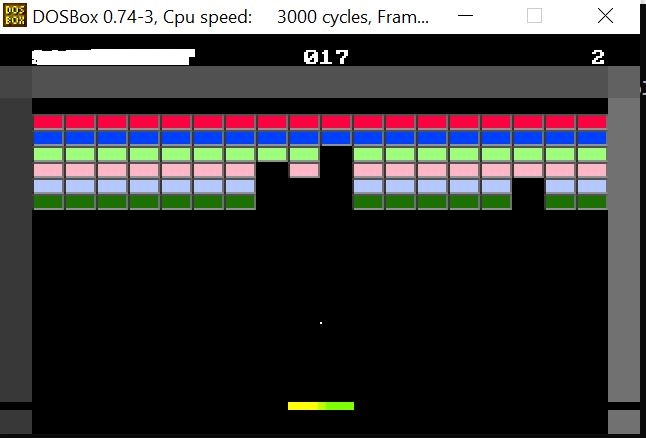

# Breakout x86 Assembly

This project is a slightly simplified version of the Breakout Game, a significant piece of gaming history released in 1976 and designed by Steve Wozniak. The game is made entirely in x86 Assembly code and is compiled with TASM. 

## How to run

I used DOSBox, an x86 emulator, to run the game. Additionally, you will need to install TASM, a Turbo Assembler, to compile the game. 

1. Move the game files to the BIN folder of wherever you have installed TASM. 
2. Within DOSBox, change the directory to the bin folder and run `tasm bricks.asm` to compile the bricks file
3. Then run `tlink bricks util_br` to link the two files and create an executable
4. Finally, run `bricks` to start the game! 

## Power Ups
There are a few rules that are not self-explanatory.... power-ups! 

Every time you achieve a 50 score, you can activate a power-up. There are two power-ups available. 

1. Increased paddle length: Press `1` on the keyboard to activate this power-up for a temporarily giant paddle. 
2. Laser bullet: Press `2` on the keyboard to activate this power-up to shoot a single bullet from the center of the paddle that hits and destroys the first brick it comes in contact with. 
